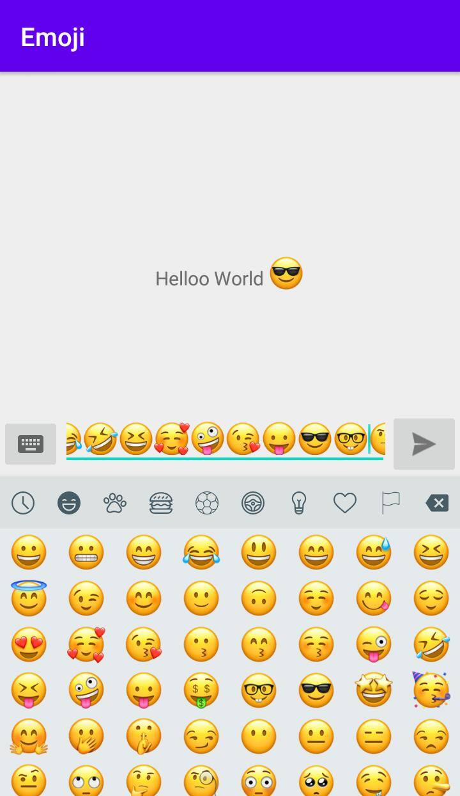

# EmojiLibrary
Hello World!

FiftyoneMoon provide you EmojiLibrary which have all latest ios emoji and it's inspired by [SuperNova-Emoji](https://github.com/hani-momanii/SuperNova-Emoji).
FiftyoneMoon says you can use this libaray in your project with full authority.

Here some information about EmojiLibrary,

minSdkVersion: 16
maxSdkVersion: 30 (Latest)
[](https://jitpack.io/#fiftyonemoon/EmojiLibrary)

## Implementation

```groovy
allprojects {
		repositories {
			...
			maven { url 'https://jitpack.io' }
		}
	}
```

```groovy
implementation 'com.github.fiftyonemoon:EmojiLibrary:1.0'
```

## SampleActivity
- [`SampleActivity`](app/src/main/java/com/fiftyonemoon/SampleActivity.java) This is sample activity of library. 




## Java Usage

### XML Usage
```groovy
//EmojiTextView 

<com.fiftyonemoon.emojilibrary.EmojiTextView
        android:id="@+id/tvSample"
        android:layout_width="wrap_content"
        android:layout_height="wrap_content"
        android:text="Hello World!"
        android:layout_centerInParent="true"
        android:padding="5dp"
        android:textSize="15sp"
        emoji:emojiconSize="28sp"
        emoji:emojiconAlignment="bottom" />
	
//EmojiEditText

<com.fiftyonemoon.emojilibrary.EmojiEditText
        android:id="@+id/edSample"
        android:layout_width="wrap_content"
        android:layout_height="wrap_content"
        android:hint="Type here..."
        android:layout_toLeftOf="@+id/btnSend"
        android:layout_toRightOf="@+id/btnEmoji"
        android:inputType="text"
        android:layout_toStartOf="@+id/btnSend"
        android:layout_toEndOf="@+id/btnEmoji"
	emoji:emojiconSize="28sp"/>
	
```
### Initialize Emoji Action

```groovy
//Default emoji background
EmojiActions emojiActions = new EmojiActions(Context c ,View view, EmojiEditText emojiEditText, ImageButton emojiButton);
```

### Change background color

```groovy
//Change emoji background
EmojiActions emojiActions = new EmojiActions(Context c,View view,EmojiEditText emojiEditText,ImageButton emojiButton,String iconPressedColor,String tabsColor,String backgroundColor);

//Example
EmojiActions emojiActions = new EmojiActions(this,rootView,emojiEditText,emojiButton,"#495C66","#FF4081","#FFFFFF");
```

### On Keyboard Listener
Set your Emoji keyboard on listener

```groovy
//In your activity
public class SampleActivity extends AppCompatActivity implements EmojiActions.KeyboardListener
```

```groovy
//Set keyboard listener
emojiActions.setKeyboardListener(this);
```
### On EditText Click Open Soft Keyboard
Simply transfer from Emoji Popup to Soft Keyboard 

```groovy
//Set on click edittext come back to soft keyboard
emojiActions.setOnClickEditTextOpenSoftKeyboard(emojiEditText);
```

### Change Emoji Drawable
Change Emoji and Keyboard button icon with drawable icon

```groovy
//You can change emoji icon with drawbale  --->>> 1. FOR KEYBOARD 2. FOR EMOJI ICON
emojiActions.setDrawableIcon(R.drawable.ic_baseline_keyboard_24, R.drawable.ic_baseline_emoji_emotions_24);
```

# Proguard

No configuration needed.

# License

Licensed under the Apache License, Version 2.0
